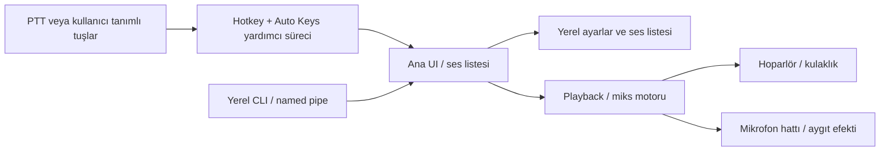
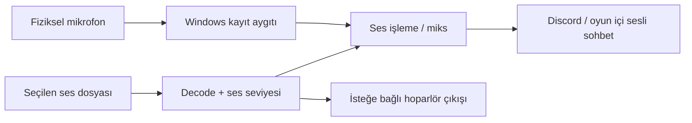
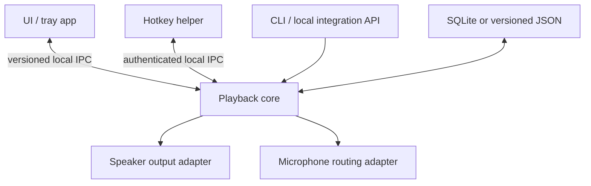

# Soundpad Teknik Analiz ve Kendi Uygulaman İçin Tasarım Notları

> Kapsam: Bu belge, Soundpad'in herkese açık belgeleri ve bu bilgisayardaki kurulum gözlemleri üzerinden hazırlanmıştır. Kaynak kodu, özel protokolü veya tersine mühendislik ürünü bilgi içermez. "Önerilen" başlıklı kısımlar, aynı kullanıcı ihtiyacını karşılayacak özgün bir uygulama tasarımıdır.

## 1. Ürün Problemi

Soundpad, yerel ses dosyalarını hızlıca oynatıp üç hedefe yönlendiren Windows tabanlı bir ses tahtasıdır:

| Çalma hedefi | Kullanıcı etkisi |
|---|---|
| Hoparlör / kulaklık | Sesi yalnızca kullanıcı duyar. |
| Mikrofon hattı | Sesi Discord, oyun içi sesli sohbet vb. uygulamalara gönderir. |
| İkisi birden | Kullanıcı ve karşı taraf sesi duyar. |

Öne çıkan kullanıcı deneyimi; ses listesi, kategoriler, hotbar, global kısayollar, ses kaydı/düzenleme, ses seviyesi normalizasyonu, Auto Keys (ör. PTT tuşuna basma) ve sistem tepsisi yaşam döngüsüdür.

## 2. Gözlenen Bileşenler

Bu bilgisayardaki kurulum sürümü **4.0.30**. Kurulum klasöründe şu ana bileşenler var:

| Dosya | Rol |
|---|---|
| `Soundpad.exe` | Ana grafik arayüz ve uygulama yaşam döngüsü. |
| `SoundpadService.exe` | Global hotkey ve Auto Keys işlevleri. Ana uygulama tarafından başlatılır/kapatılır. |
| `TTS.dll` | Metinden sese ilişkin bileşen. |
| `UniteFx.dll` / `UniteFx-ARM.dll` | Ses aygıtı/efekt uzantısı bileşeni. Tam iç topolojisi herkese açık değil. |

Resmî belgeler ana uygulamanın `SoundpadService.exe` sürecini otomatik başlattığını ve bu sürecin hotkey ile Auto Keys'i yönettiğini doğruluyor. [Soundpad service açıklaması](https://www.leppsoft.com/soundpad/en/help/code/426)



Bu şema, belgelenmiş özellikleri gösterir; süreçler arası haberleşmenin gerçek protokolünü değil, tasarım için uygun sınırları anlatır.

## 3. Davranışsal Model

### Mikrofon sesi nasıl taşınır?

Soundpad'in belgelenmiş modeli, **seçili Windows kayıt aygıtına** (çoğunlukla fiziksel mikrofon) bağlanmak ve çalınan sesi o mikrofon sinyaline eklemektir. Yani kullanıcı Discord/oyun içinde aynı mikrofon aygıtını seçmeye devam eder; uygulama sesin yoluna arada girer.



- **Microphone modu:** Ses dosyası, fiziksel mikrofon sinyaline eklenir ve karşı tarafa gider.
- **Both modu:** Aynı ses hem hoparlöre hem mikrofon hattına gider.
- **Speakers modu:** Ses yalnızca kullanıcıya çalınır.
- **Block voice:** Belgelenen davranışa göre fiziksel mikrofonun sesini mikslemek yerine bastırır; karşı taraf yalnızca çalınan sesi duyar.

Soundpad, varsayılan kayıt aygıtına kurulum yapar ve aygıt tercihlerinde hangi cihazların etkin olacağını seçtirir. Bu yüzden bunu "ayrı bir sanal mikrofon seçtiriyor" yaklaşımıyla karıştırmamak gerekir; ürünün belgelenmiş yaklaşımı, seçili kayıt aygıtı üzerindeki ses işleme katmanıdır. [Resmî aygıt yapılandırması](https://www.leppsoft.com/soundpad/en/help/manual/config/), [resmî özellik açıklaması](https://www.leppsoft.com/soundpad/en/home/)

Kendi uygulaman için bu diyagram, hedef davranışı açıklar; Soundpad'in sürücü/efekt zincirini kopyalama tarifi değildir. Aynı sonucu kendi ses işleme katmanın veya imzalı sanal aygıt/sürücü tasarımınla özgün biçimde kurmalısın.

### Başlatma ve tepsi

- Uygulama ayarları `Start minimized`, `Minimize to tray`, `Show tray icon` ve `Minimize instead of close` gibi arayüz tercihlerini içerir.
- Soundpad, küçültülmüş başlama durumunu ve sistem tepsisine küçültmeyi destekler. [Resmî FAQ](https://www.leppsoft.com/soundpad/en/help/faq/window-not-visible)
- Ana pencere UI amacıyla vardır; ses/hotkey işlevleri arka planda çalışacak şekilde tasarlanmıştır.

### Ses çalma

1. Kullanıcı bir ses seçer veya hotkey tetikler.
2. Çalma modu belirlenir: hoparlör, mikrofon veya ikisi.
3. Ses çözümlenir, gerekirse ses seviyesi normalize edilir.
4. Ses seçilen çıkışlara gönderilir.
5. Gerekirse tekrar, duraklatma, atlama veya seek uygulanır.

### Hotkey ve Auto Keys

- Her ses için kısayol, kategori için rastgele çalma kısayolu ve özel kontrol kısayolları tanımlanabilir.
- Hotbar ayrı bir hızlı erişim yüzeyidir; sayfa, renk ve hotkey taşıyabilir.
- Auto Keys, ses çalma sırasında örneğin Push-to-Talk tuşuna basmak için tasarlanmıştır.
- Hotkey/Auto Keys işini ayrı süreçte tutmak; UI çökerse veya kapanırsa sorumluluk ayrımı sağlar.

Ana pencere, hotbar, kategoriler, çalma modları ve Auto Keys davranışları [resmî kullanım kılavuzunda](https://www.leppsoft.com/soundpad/en/help/manual/tutorial/main/) anlatılır.

## 4. Yerel Veri ve Ayar Sınırları

| Konum | Belgelenmiş veya gözlenen rol |
|---|---|
| `%APPDATA%\Leppsoft` | Çalışma kopyası ses listesi, yedekler, istatistikler ve varsayılan kayıt alanı. Yerel kurulumda `.spl` dosyaları gözlendi. |
| `HKCU\SOFTWARE\Leppsoft\Soundpad\MainFrame` | Pencere, tepsi, hotkey, çalma modu ve tercih ayarları. |
| `C:\ProgramData\Leppsoft\Soundpad` | Aygıt/instance günlükleri ve çökme dökümleri. Yerel kurulumda günlük dosyası gözlendi. |
| Kurulum klasörü | Uygulama ikilileri, çeviriler ve bildirim/demo sesleri. |

Resmî kılavuz, çalışma dosyalarının AppData altında; sürücü günlükleri ve crash dump'ların ProgramData altında tutulduğunu belirtir. [Dosya yerleşimi](https://www.leppsoft.com/soundpad/en/help/manual/misc/)

## 5. Resmî Kontrol Yüzeyi

Soundpad, yerel komut satırı kontrolü sunar:

```text
Soundpad.exe -rc DoPlaySound(1)
Soundpad.exe -rc DoPlaySound(5,true,false)
Soundpad.exe -rc DoStopSound()
Soundpad.exe -rc DoTogglePause()
Soundpad.exe -rc DoSeekMs(10000)
```

Belgelenen komutlar; ses oynatma, kategori içinden oynatma, önceki/sonraki ses, durdurma, duraklatma, atlama, seek ve kayıt başlatma/durdurmayı kapsar. Uygulamalar arası kontrol için aynı bilgisayarda bir **named pipe** kullanıldığı da belirtilir. Komut listesi sürüme göre değişebildiği için güncel uygulamada `Soundpad.exe --help` kontrol edilmelidir. [Remote Control API](https://www.leppsoft.com/soundpad/help/manual/tutorial/rc/)

Kendi uygulaman için öneri: kendi IPC protokolünü sürümlü tasarla. Örneğin `pipe://your-app/v1`, JSON mesajları ve açık hata kodları kullan. Soundpad'in kapalı named-pipe protokolünü taklit etmeye veya ona bağımlı olmaya çalışma.

## 6. Kendi Uygulaman İçin Önerilen Mimari

### MVP katmanları

1. **Desktop UI**
   - Ses listesi, kategori, arama, hotbar ve tepsi menüsü.
   - UI'dan bağımsız bir `PlaybackController` arayüzü.

2. **Medya kitaplığı**
   - `SoundItem`: id, dosya yolu, etiketler, ses seviyesi, hotkey, hedef mod.
   - `Category`: id, ad, sıralama, ikon, ses referansları.
   - Dosya yollarını doğrula; bozuk/taşınmış dosyalar için açık hata durumu göster.

3. **Ses motoru**
   - Kod çözme, miksleme, ses seviyesi, durdurma/seek ve oynatma kuyruğu.
   - Hoparlör çıkışı ile mikrofon hattını ayrı soyutlamalar halinde tut.
   - Hedef gecikmesini ölç; ses callback'inde disk I/O veya UI işi yapma.

4. **Mikrofon yönlendirme**
   - Bu, ürünün en zor parçasıdır. Windows ses sürücüsü/aygıt efekti, ses aygıtı değişimleri ve sürücü imzalama gerektirir.
   - İlk sürümde yalnızca hoparlör çalmayı tamamlamak; mikrofon zincirini sonra eklemek daha güvenlidir.

5. **Arka plan yardımcı süreci**
   - Global hotkey ve otomatik tuş basma işlerini UI'dan ayır.
   - IPC: named pipe veya yerel soket; yalnızca aynı kullanıcıya erişim izni ver.
   - Yardımcı süreç, UI'a bağlanamazsa güvenli biçimde tuş basmayı bırakmalı.

6. **Yerel API**
   - Örnek komutlar: `play`, `stop`, `pause`, `seek`, `setOutputMode`, `startRecording`.
   - Sürüm alanı, istek kimliği, zaman aşımı ve yapılandırılmış hata cevabı kullan.

### Önerilen süreç modeli



## 7. Güvenlik, Gizlilik ve Dayanıklılık

- **Auto Keys:** Varsayılan olarak kapalı olsun; hangi tuşun ne zaman basılacağını kullanıcı açıkça görsün ve onaylasın.
- **Yerel IPC:** Herhangi bir uygulamanın rastgele ses çalmasını engellemek için kullanıcı oturumu ACL'i, istek doğrulama ve oran sınırlaması ekle.
- **Sürücü katmanı:** Kod imzalama, güvenli güncelleme, çökme raporu ve geri alma stratejisi olmadan kernel/driver bileşeni dağıtma.
- **Aygıt değişimi:** Kulaklık takılması, varsayılan mikrofonun değişmesi, uyku/uyanma ve USB aygıt kopması için yeniden bağlanma durumu tasarla.
- **Telemetri:** Ses dosyası adları ve konuşma/kayıt içerikleri hassas olabilir; varsayılan olarak toplama. Günlükleri kullanıcı denetiminde tut.
- **Yetki seviyesi:** UI'ı yönetici olarak çalıştırmayı varsayılan yapma. Farklı integrity level'daki uygulamalarla hotkey/otomasyon davranışını özellikle test et.

## 8. Uygulanabilir Yol Haritası

| Aşama | Teslim | Başarı ölçütü |
|---|---|---|
| 1 | UI + ses listesi + hoparlör çalma | Ses seçilip gecikmesiz çalınır. |
| 2 | Hotkey + tepsi | UI kapalıyken kullanıcı kısayolu çalışır. |
| 3 | Kategori/hotbar + kayıt | Medya yönetimi kalıcı ve geri alınabilir olur. |
| 4 | Yerel API | CLI ve başka bir yerel uygulama kontrollü komut gönderebilir. |
| 5 | Mikrofon yönlendirme | Seçili aygıtta sesli sohbet testleri stabil çalışır. |
| 6 | Auto Keys + güvenlik/telemetri | Kullanıcı onayı, denetim kaydı ve güvenli durdurma vardır. |

## 9. Bilinmeyenler ve Kaçınılması Gereken Varsayımlar

- Soundpad'in dosya biçiminin ayrıntıları, driver protokolü, named-pipe mesaj biçimi ve ses zincirinin tam iç yapısı herkese açık değildir.
- Uygulamanı bunlara bağımlı kılma; kendi veri şemanı, IPC sözleşmeni ve ses yönlendirme katmanını tasarla.
- Resmî sayfa Soundpad'in C++ ile geliştirildiğini söyler; bu, kendi uygulamanın aynı teknolojiyle yazılması gerektiği anlamına gelmez. C#, Rust veya C++ seçimini ekip yetkinliği ve ses/driver ihtiyaçlarına göre yap.

## Kaynaklar

1. [Soundpad ana özellik sayfası](https://www.leppsoft.com/soundpad/en/home/)
2. [Ana pencere, kategoriler, hotbar, Auto Keys ve çalma davranışı](https://www.leppsoft.com/soundpad/en/help/manual/tutorial/main/)
3. [Ses aygıtı yapılandırması](https://www.leppsoft.com/soundpad/en/help/manual/config/)
4. [Remote Control API ve named pipe açıklaması](https://www.leppsoft.com/soundpad/help/manual/tutorial/rc/)
5. [Dosya ve süreç yerleşimi](https://www.leppsoft.com/soundpad/en/help/manual/misc/)
6. [Hotkey/Auto Keys yardımcı süreci](https://www.leppsoft.com/soundpad/en/help/code/426)
